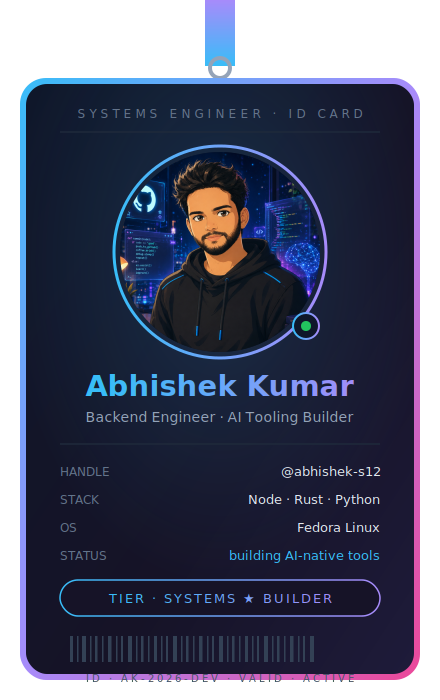

<div align="center">


<br/>

<a href="https://www.linkedin.com/in/abhishek-k-a16468351"></a>
<a href="https://x.com/abxdevops"></a>
<a href="mailto:abhishek.ss1003@gmail.com"></a>
<a href="https://dev.to/lintits"></a>

<br/><br/>


</div>

<br/>


<br/>

## 🪐 About Me

<table align="center">
<tr>
<td width="60%" valign="top">

```yaml
whoami:      Abhishek Kumar
role:        Backend Engineer · AI Tooling Builder
education:   Computer Science Engineering Student
focus:       Distributed Systems · AI Infra · Rust
os:          Fedora Linux (daily driver)
philosophy:  "The best way to understand a system is to build one."
```

I pull systems apart to see how they actually work — schedulers, consensus, query planners, whatever's under the hood. Most of my time goes into building things that force me to learn the internals: an AI platform that indexes and reasons over real codebases, a packaging tool that has to be byte-for-byte deterministic, a verifier that trusts nothing it can't independently check.

- 🤖 &nbsp;Building AI-powered developer tools
- 🦀 &nbsp;Learning Rust for systems programming
- ⚙️ &nbsp;Backend with Node.js, Python, Rust
- ☁️ &nbsp;Exploring Kubernetes, AWS, cloud-native infra
- 📚 &nbsp;Deep in system design & distributed systems
- 💬 &nbsp;Ask me about backend architecture or Linux setups

</td>
<td width="40%" valign="top" align="center">



</td>
</tr>
</table>

<br/>


<br/>

## 🛠️ Tech Arsenal

<div align="center">

**🟢 Production experience**
<br/>


**🟡 Currently deepening**
<br/>


**🔵 AI / ML tooling**
<br/>
   

</div>

<br/>


<br/>

## 🌌 Featured Builds

<table>
<tr><td>

### 🏢 [CodePilot AI](https://github.com/abhishek-s12/codepilot-ai)
Self-hosted, enterprise-grade codebase intelligence — Copilot for teams that never leaves your network. AI chat, AST + semantic indexing, interactive call graphs, RBAC, full K8s/Helm deploy.

`React 19` `FastAPI` `Qdrant` `PostgreSQL` `Kubernetes` `Ollama`

[](https://codepilot-ai-wine.vercel.app/) [](https://github.com/abhishek-s12/codepilot-ai)

</td></tr>
<tr><td>

### 📦 [PackWiser](https://github.com/abhishek-s12/packwiser)
Industrial-grade Rust packaging toolchain — secrets scanning, deterministic archiving, SBOM generation (CycloneDX/SPDX), Ed25519 signing, policy gates.

`Rust 2024` `Clean Architecture` `Cargo Workspace` `Ed25519` `SBOM`

[](https://github.com/abhishek-s12/packwiser/actions) [](https://github.com/abhishek-s12/packwiser)

</td></tr>
<tr><td>

### ✅ [Trustgate](https://github.com/abhishek-s12/trustgate)
A deliberately dumb, agent-blind verifier for AI coding agents — checks real exit codes, real git diffs, real HTTP boot checks instead of trusting the agent's self-report.

`TypeScript` `CLI` `Git Hooks` `GitHub Actions`

[](https://github.com/abhishek-s12/trustgate)

</td></tr>
<tr><td>

### ✍️ [Chunkwiser](https://dev.to/lintits/i-built-chunkwiser-a-tool-that-understands-large-codebases-without-hallucinating-ncp)
Chunking + retrieval layer built to keep AI code-understanding grounded in what's actually in the codebase — not hallucinated.

`AI Tooling` `RAG` `Code Understanding`

[](https://dev.to/lintits/i-built-chunkwiser-a-tool-that-understands-large-codebases-without-hallucinating-ncp)

</td></tr>
</table>

<br/>


<br/>

## 🐍 Live Contribution Snake

<div align="center">

<!-- Genuinely animated GIF — a snake visibly eats your real contribution graph. Regenerated nightly by the workflow below. -->


</div>

<br/>


<br/>

## 📊 GitHub Analytics

<div align="center">


<br/><br/>


<br/><br/>


<br/><br/>


</div>

<br/>


<br/>

## 🎯 Now Running

<div align="center">


</div>

**🌱 Currently learning:** Rust · Distributed Systems · Kubernetes · AWS · AI Infrastructure

<br/>


<br/>

## ✍️ Latest from the Blog

<!-- BLOG-POST-LIST:START -->
- [I built Chunkwiser: a tool that understands large codebases without hallucinating](https://dev.to/lintits/i-built-chunkwiser-a-tool-that-understands-large-codebases-without-hallucinating-ncp)
<!-- BLOG-POST-LIST:END -->

> Auto-refreshes from dev.to once the workflow below is added.

<br/>


<br/>

<div align="center">

## 🤝 Let's Connect

<a href="https://github.com/abhishek-s12"></a>
<a href="https://www.linkedin.com/in/abhishek-k-a16468351"></a>
<a href="https://x.com/abxdevops"></a>
<a href="mailto:abhishek.ss1003@gmail.com"></a>
<a href="https://dev.to/lintits"></a>

<br/><br/>

<i>"The best way to understand a system is to build one."</i>

<br/><br/>


</div>
