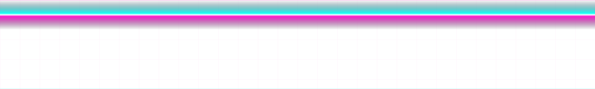

<!-- ======================================================================
     SETUP — read once, then delete this comment block.

     WHY THINGS WERE BREAKING
     The capsule-render header/footer and some stat cards are all served
     live by free, shared, community-run instances (capsule-render.vercel.app,
     github-readme-stats.vercel.app, streak-stats.demolab.com). Their own
     repos say outright: "for reliable use, fork and deploy your own
     instance" — the shared ones get rate-limited or go down under load,
     which is why they sometimes render as broken images with no warning.

     THE FIX USED BELOW
       - Header, footer, and both scan lines are now custom SVGs that
         live in YOUR repo (assets/ folder) — no third-party server
         involved, so they can't go down.
       - Stats/streak/trophy are kept (they're the standard, and usually
         fine) but see the "bulletproof stats" note near that section for
         a one-time setup that makes them commit-once, never-break.

     TO MAKE THE LOCAL SVGs WORK:
       1. Repo must be named exactly your username (abhishek-s12/abhishek-s12).
       2. Add an `assets/` folder with: hero-banner.svg, footer-banner.svg,
          scan-vertical.svg, glitch-online.svg, glitch-secure.svg,
          loading-bar.svg (all provided alongside this file).
       3. Commit README.md at the repo root.
     ====================================================================== -->

`AI ENGINEER` · `BACKEND` · `RUST` · `DISTRIBUTED SYSTEMS` · `OPEN SOURCE`

I build AI-native tools and take systems apart to see how they actually work.
Currently deep in Rust, distributed systems, and RAG infra — shipping something almost every week.

### ⚡ STACK

 

 

  

### 🚀 FEATURED BUILDS

<table align="center">
<tr>
<td width="50%">

AI code intelligence platform — semantic search, call graphs, self-hosted chat over your repo.

`FastAPI` `React` `Qdrant` `Docker` `Ollama`

</td>
<td width="50%">

Deterministic Rust packaging with signing, SBOMs, and supply-chain verification baked in.

`Rust` `Ed25519` `SBOM` `CLI`

</td>
</tr>
<tr>
<td width="50%">

Verification-first tooling for AI coding agents — trusts nothing, checks everything.

`TypeScript` `Git` `CLI`

</td>
<td width="50%">

Context engineering for large codebases — smarter chunking so LLMs stop hallucinating.

`Python` `RAG` `Vector Search`

</td>
</tr>
</table>

### 📊 STATS

⚠️ these four are live third-party renders — usually fine, occasionally rate-limited. See "bulletproof stats" below to make them unbreakable.

<picture>
<source media="(prefers-color-scheme: dark)" srcset="https://raw.githubusercontent.com/abhishek-s12/abhishek-s12/output/github-contribution-grid-snake-dark.svg">

</picture>

&nbsp;
&nbsp;

⚡ if you're building AI infra or Rust tooling, let's talk ⚡

<!-- ======================================================================
     BULLETPROOF STATS (optional, ~5 min, makes the STATS section
     immune to third-party downtime forever)

     Add .github/workflows/metrics.yml to your repo with:

     name: metrics
     on:
       schedule: [{ cron: '0 0 * * *' }]
       workflow_dispatch:
     jobs:
       metrics:
         runs-on: ubuntu-latest
         steps:
           - uses: lowlighter/metrics@latest
             with:
               token: ${{ secrets.GITHUB_TOKEN }}
               base: header, activity, community, repositories, languages
               config_timezone: Asia/Kolkata

     This generates github-metrics.svg committed straight into your repo
     via GitHub Actions on a schedule — no live API call at view-time, so
     it literally cannot rate-limit or go down. Then swap the STATS
     section's  tags for:
       
     ====================================================================== -->
